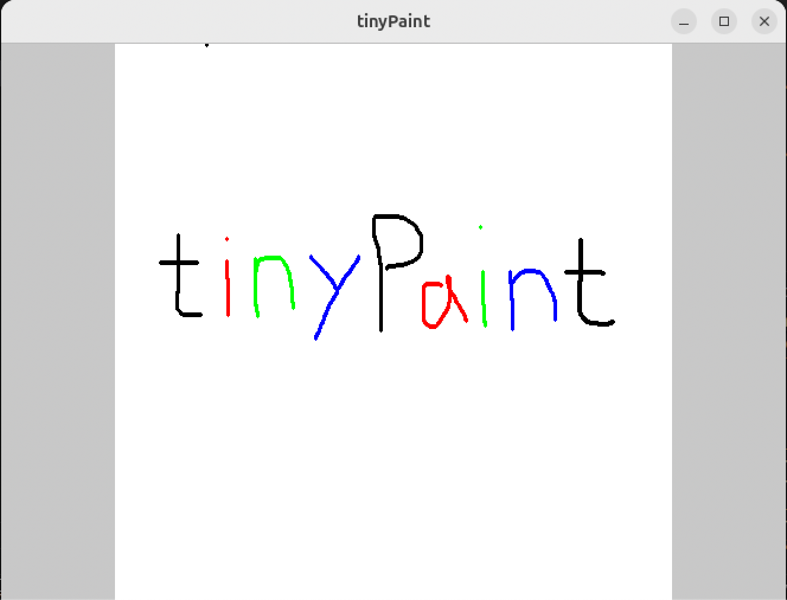

# road2ibis

Road to ibis tinyPaintは、C++とOpenGLを用いて実装したシンプルなペイントアプリケーションで、ブラシ色の変更機能、画像の保存機能、Undo/Redo機能を備えています。



## 実行方法

前提として、libglew-devやlibglfw3-devのインストールが必要。42Tokyo校舎の環境ではこれらはインストール済みとなっている。

```
// lodepng用
git submodule update --init --recursive

// コンパイル
make

// 実行
./tinyPaint
```

## 操作方法

```
マウス左ボタン: 線の描画を行う。

1,R,G,B,0キー: それぞれ、黒、赤、緑、青、透明(消しゴム)に対応。デフォルトは黒。

Sキー: 画像をoutput.pngとして保存する。

Ctrl+Z/Ctrl+Y: Undo/Redoを行う。
```

## 技術的概要

### Undo/Redo

1. 描画領域を32x32の正方形タイルに分割し、描画中のブラシ軌跡の影響範囲内にあるタイルを記録する。
2. 各タイルの座標について、PBOを利用し`glReadPixels`で非同期に読み出す。
3. その後のフレームで読み出しが完了したPBOから`glMapBufferRange`でピクセルを取得し、バックグラウンドスレッドでの書き込みキューに追加する。
4. 描画終了時、タイルについて同期的に`glReadPixels`を行い、同期的に保存する。
5. バイナリファイルへの履歴保存は、描画回数(stepID)/タイルのX座標(tileX)/タイルのY座標(tileY)の各4バイト+空のタイルかのフラグ(1バイト)+ピクセルデータのフォーマットで行われる。タイル内の全ピクセルが透明であれば、フラグに`TILE_TYPE_EMPTY`をセットし、ピクセルデータ部へのデータ挿入を行わず、ファイルサイズを削減。
6. 次の描画開始時、不要になったRedo履歴を切り詰める処理を行い、ファイルサイズを削減する。

### シェーダープログラムのバイナリキャッシュ

1. 初回起動時などでシェーダープログラムのコンパイルが完了した時、`glGetProgramBinary`でバイナリを取得、ファイルに保存。
2. 次回起動時、`glProgramBinary`でバイナリをプログラムにロードする。`glGetProgramiv`で`GL_LINK_STATUS`をチェックし、失敗していた場合またはキャッシュが存在しない場合、ソースからコンパイルを行う。

補足
- `GL_NUM_PROGRAM_BINARY_FORMATS`を見てサポートされているとき実行
- 今回のような小規模なプログラムではコンパイル時間が非常に短いため、速度の改善は限定的
